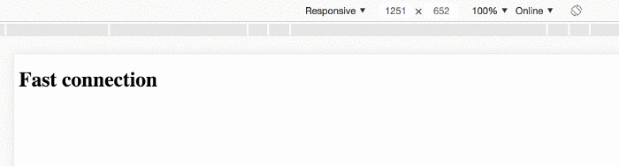

# ConnectionAware

Create a simple application that combines the [Network Information API](https://developer.mozilla.org/en-US/docs/Web/API/Network_Information_API) with Angular, to write components that render different elements for different connection speeds.

### Let's see it in action:

